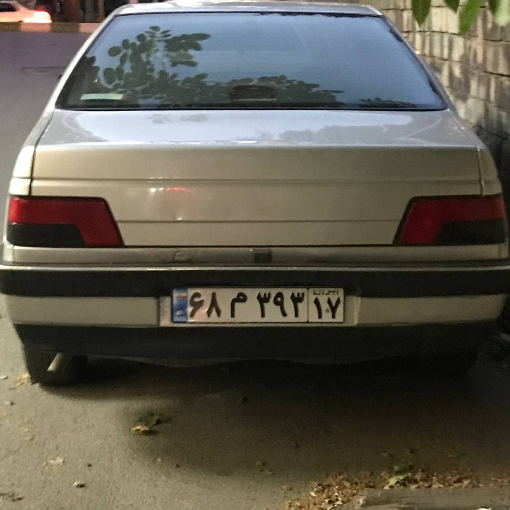
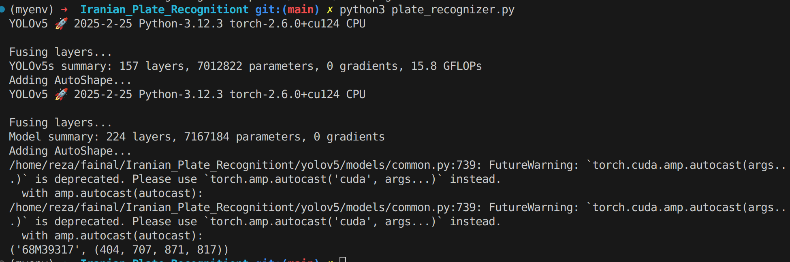

# Iranian Plate Recognizer

This repository contains a Python script for recognizing vehicle license plates using YOLO (You Only Look Once) object detection models. It consists of two main parts:
1. **Plate Detection**: Detects license plates in images.
2. **Character Recognition**: Recognizes characters on the detected license plates.

## Requirements

Ensure that you have the required dependencies installed by running:

```bash
pip install -r requirements.txt
```

The required packages include:
- `opencv-python`
- `torch`
- `ultralytics`
- `numpy`

## Files

- `plate_recognizer.py`: The main Python script for plate recognition.
- `weights/`: Folder containing the YOLO model weights files:
  - `best.pt`: Model for plate detection.
  - `yolov8n_char_new.pt`: Model for character recognition.
- `parser.py`: Helper script to get the paths of the model weights.

## Usage

1. Place the image(s) with vehicle license plates in the same directory.
2. Run the script with the image file as input.

```bash
python plate_recognizer.py
```

### Example Usage:

```python
from plate_recognizer import PlateRecognizer

# Initialize the recognizer with a desired confidence threshold
recognizer = PlateRecognizer(conf_threshold=0.4)

# Recognize the plate from an image
plate_number, bbox = recognizer.recognize_plate('car.jpg')

if plate_number:
    print(f'Recognized plate number: {plate_number}')
else:
    print('No plate detected.')
```


## For Test

### input : 

### output:



## License

This project is licensed under the MIT License - see the [LICENSE](LICENSE) file for details.

---

